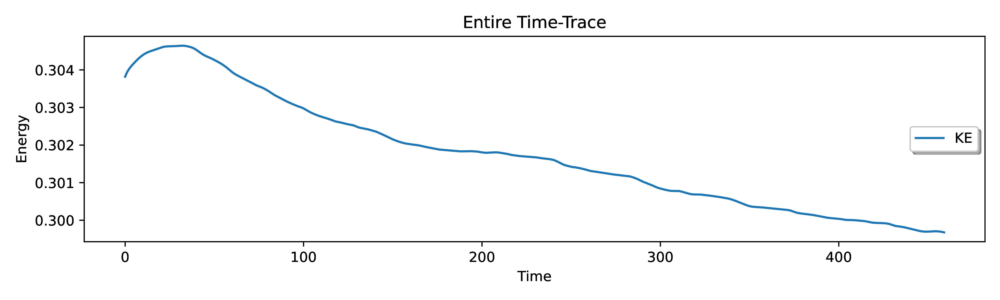

Time evolution of kinetic energy density :math:`E_{kin} = \frac{1}{2} v^{2}` in the spherical shell as function of time normalized by the viscous diffusion time :math:`\tau_{\nu} = L^{2} / \nu`. from the first data output time.

