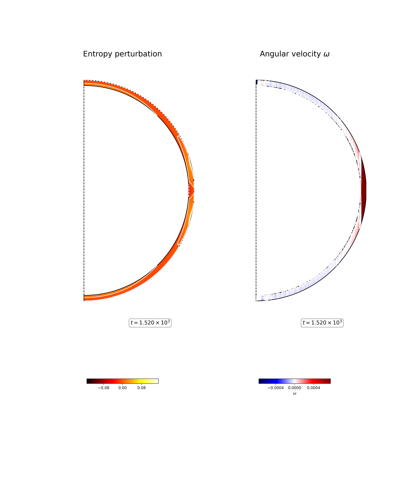

Longitudinal average ofEntropy perturbation :math:`S - (4\pi r^{2})^{-1} \int S dS` (left) and zonal velocity field :math:`u_\phi` (right) in the fluid shell at :math:`t = 1.520 \times 10^{3} \tau_{\nu}`. 

