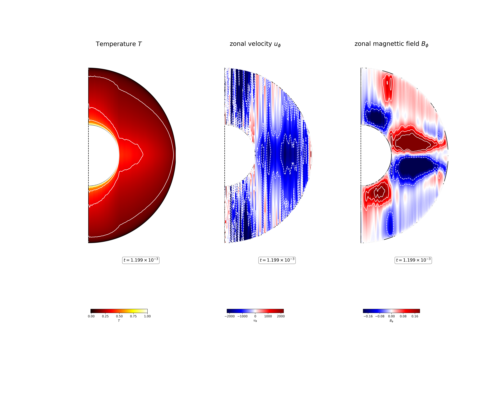

-----------------------------------------------------------
Geo-7
-----------------------------------------------------------

Directory.
=========================================
Data is stored in the following directory:

- `ryadav/ensemble4/Pm0.03_Pr1_eta0.35_Ek1E-7_Ra3E11_no-slip_dyn <https://farm.cse.ucdavis.edu/~hrmatsui/INCITE/ryadav/ensemble4/Pm0.03_Pr1_eta0.35_Ek1E-7_Ra3E11_no-slip_dyn>`_

Parameters.
=========================================

The following parameters are used:

.. csv-table::
   :file: param.csv
   :encoding: UTF-8
   :header-rows: 1

Avaiable data.
==========================================

The following data for analysis are aviable:

- Parameter file (original): `main_input.org <https://farm.cse.ucdavis.edu/~hrmatsui/INCITE/ryadav/ensemble4/Pm0.03_Pr1_eta0.35_Ek1E-7_Ra3E11_no-slip_dyn/main_input.org>`_
- Parameter file (for current version): `main_input <https://farm.cse.ucdavis.edu/~hrmatsui/INCITE/ryadav/ensemble4/Pm0.03_Pr1_eta0.35_Ek1E-7_Ra3E11_no-slip_dyn/main_input>`_
- Checkpoint data directory: `Checkpoint <https://farm.cse.ucdavis.edu/~hrmatsui/INCITE/ryadav/ensemble4/Pm0.03_Pr1_eta0.35_Ek1E-7_Ra3E11_no-slip_dyn/Checkpoint>`_
- Global averaged data directory: `G_Avgs <https://farm.cse.ucdavis.edu/~hrmatsui/INCITE/ryadav/ensemble4/Pm0.03_Pr1_eta0.35_Ek1E-7_Ra3E11_no-slip_dyn/G_Avgs>`_
- Sphere averaged data directory: `Shell_Avgs <https://farm.cse.ucdavis.edu/~hrmatsui/INCITE/ryadav/ensemble4/Pm0.03_Pr1_eta0.35_Ek1E-7_Ra3E11_no-slip_dyn/Shell_Avgs>`_
- Shell spectrum data directory: `Shell_Spectra <https://farm.cse.ucdavis.edu/~hrmatsui/INCITE/ryadav/ensemble4/Pm0.03_Pr1_eta0.35_Ek1E-7_Ra3E11_no-slip_dyn/Shell_Spectra>`_
- Longitudinal averaged data directory: `AZ_Avgs <https://farm.cse.ucdavis.edu/~hrmatsui/INCITE/ryadav/ensemble4/Pm0.03_Pr1_eta0.35_Ek1E-7_Ra3E11_no-slip_dyn/AZ_Avgs>`_
- Fields on spheres directory: `Shell_Slices <https://farm.cse.ucdavis.edu/~hrmatsui/INCITE/ryadav/ensemble4/Pm0.03_Pr1_eta0.35_Ek1E-7_Ra3E11_no-slip_dyn/Shell_Slices>`_
- Equatorial fields directory: `Equatorial_Slices <https://farm.cse.ucdavis.edu/~hrmatsui/INCITE/ryadav/ensemble4/Pm0.03_Pr1_eta0.35_Ek1E-7_Ra3E11_no-slip_dyn/Equatorial_Slices>`_
Examples of visualized images.
=======================================

.. include:: ./G_Avgs_caption.rst

.. figure:: ./images/Shell_Slices_Br_0.pdf
   :width: 800px
   :align: center

Radial magnetic field :math:`B_r` at the outer boundary :math:`r = r_o`.

.. figure:: ./images/Shell_Slices_Ur_2.pdf
   :width: 800px
   :align: center

Radial velocity field :math:`u_r` in the fluid shell.

.. figure:: ./images/Shell_Slices_temp_2.pdf
   :width: 800px
   :align: center

Temperature :math:`T` in the fluid shell.

Temperature :math:`T`, (left),  zonal velocity field :math:`u_\phi`, (middle),  and zonal magnetic field :math:`B_\phi`, (right) in the fluid shell.

.. include:: ./Equatorial_Slices_caption.rst

.. figure:: ./images/MPower_0.pdf
   :width: 800px
   :align: center
   :alt: Alternate Text

Magnetic energy density spectra as a function of spherical harmonic degree :math:`l`.

.. figure:: ./images/KPower_2.pdf
   :width: 800px
   :align: center
   :alt: Alternate Text

Kinetic energy density spectra as a function of spherical harmonic degree :math:`l`.
