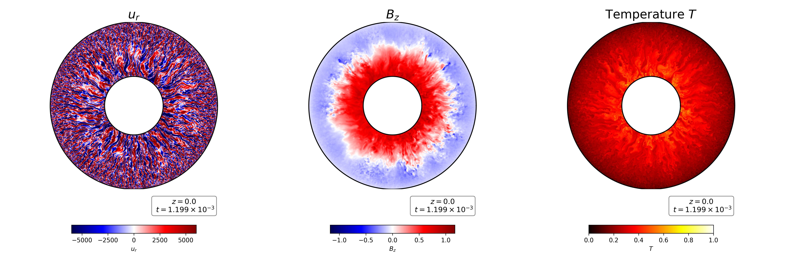

Radial component of the velocity field :math:`u_r` (left),  :math:`z`-component of the magnetic field :math:`B_z` (middle),  and temperature :math:`T` (right) at the equatorial plane :math:`z = 0.0` and  at :math:`t = 1.199 \times 10^{-3} \tau_{\nu}`. 

