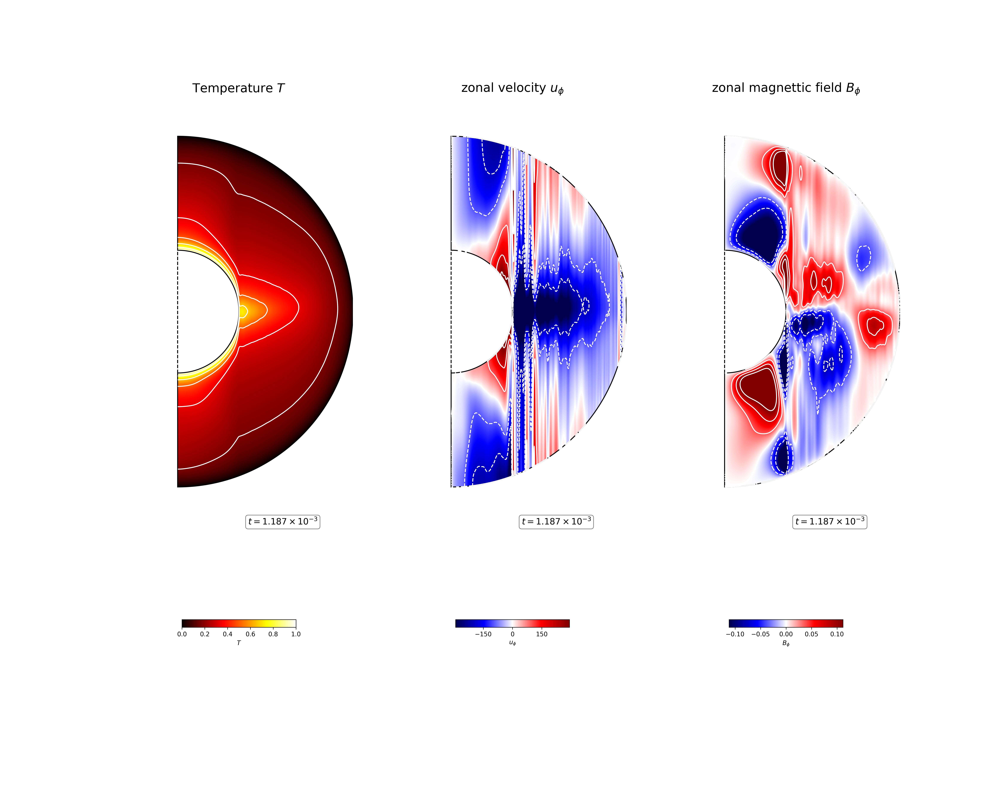

Longitudinal average of Temperature :math:`T`, (left), zonal velocity field :math:`u_\phi`, (middle), and zonal magnetic field :math:`B_\phi`, (right) in the fluid shell at :math:`t = 1.187 \times 10^{-3} \tau_{\nu}`. 

